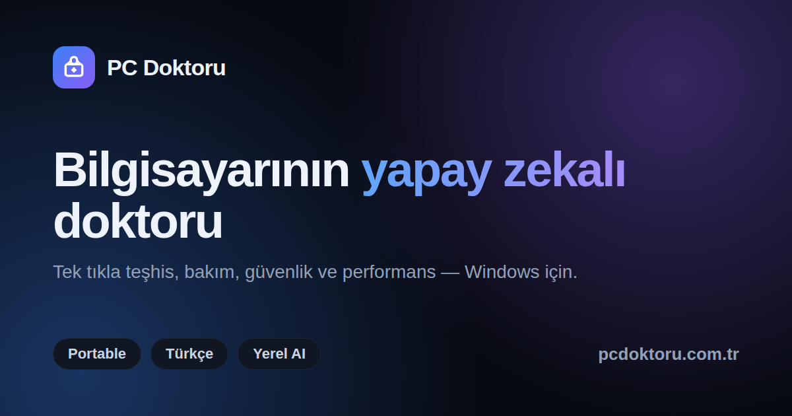

  

<h1 align="center">PC Doktoru — Süper Ajan</h1>

  <b>Yapay zeka destekli Windows bakım, teşhis ve güvenlik konsolu.</b> 
  Portable · Türkçe arayüz · Yerel AI · Kurulum gerektirmez

  <a href="https://pcdoktoru.com.tr">🌐 pcdoktoru.com.tr</a> ·
  <a href="https://pcdoktoru.com.tr/indir">⬇️ İndir</a> ·
  <a href="https://pcdoktoru.com.tr/satin-al">🛒 Satın Al</a> ·
  <a href="https://forge.numexai.com.tr">🔧 Numex Forge</a>

---

## Neler yapar?

- **Süper Ajan puanlama:** 6 direkli kalite skoru ve proaktif önerilerle sisteminin durumunu tek bakışta gör.
- **Yapay zeka asistanı:** Doğal dille teşhis, tamir ve dosya arama. Yerel Ollama ya da offline kural tabanlı modla çalışır.
- **Otonom mod:** Tespit → eylem planı → onay → uygula. Sorunları kendisi bulur, senin izninle çözer.
- **Rollback ve güvenli tamir:** Riskli işlemlerden önce geri yükleme noktası alır, her adımı kaydeder, gerekirse geri alır.
- **Güvenlik ve denetim:** Komut beyaz listesi, audit log, Windows olay günlükleri ve VPN yardımcısı tek panelde.
- **Yazılım Merkezi:** Winget ile program ara ve kur, eksik sürücü ve bileşenleri tek tıkla tamamla.

## Başlarken

1. [pcdoktoru.com.tr/indir](https://pcdoktoru.com.tr/indir) adresinden portable ZIP'i indir.
2. Klasöre çıkar, `PC Doktoru.exe`'ye sağ tıkla → **Yönetici olarak çalıştır**.
3. Lisans anahtarını gir ya da **14 günlük ücretsiz denemeyi** başlat (kart gerekmez).

**Gereksinim:** Windows 10 / 11

## Fiyatlandırma

| Plan | Fiyat |
|------|-------|
| Ücretsiz deneme | 14 gün, tam özellik |
| Bireysel | ₺349 / yıl |
| Aile | ₺549 / yıl |
| İşletme (10+ PC) | Teklif için [destek@pcdoktoru.com.tr](mailto:destek@pcdoktoru.com.tr) |

## Numex AI ekosistemi

PC Doktoru, **Numex AI Bilişim Teknolojileri** projelerinin bir parçasıdır.

- [**Numex AI**](https://numexai.com.tr): Sohbet, görsel, ses ve bilgi tabanı platformu
- [**Numex Forge**](https://forge.numexai.com.tr): Kod deposu platformu. GitHub, GitLab, Gitea, Gogs, OneDev, GitBucket ve Codebase'den depolarını tek tıkla taşı
- **Numex Agent:** Otonom ajanlar ile tespit, plan ve otomatik çözüm
- **Numex Codex:** Kod üretimi ve geliştirici asistan araçları
- **Numex Okul:** AI destekli eğitim ve içerik üretimi

## Destek

📧 [destek@pcdoktoru.com.tr](mailto:destek@pcdoktoru.com.tr)

---

<b>Geliştirici notları (site ve deploy)</b>

Bu depo `pcdoktoru.com.tr` tanıtım sitesini ve lisans API'sini içerir (Vercel).

- `/` — ana sayfa
- `/indir` — portable indirme (ZIP linki `site-config.js` içinde)
- `/satin-al` — Iyzico ile lisans satın alma
- `api/` — lisans API'si (Vercel Blob)
- `site-config.js` — indirme linki ve sosyal medya hesapları (`PCD_SOCIAL`)

**Git + Vercel otomatik deploy**

1. GitHub'da boş repo: `mobilcep/pcdoktoru`
2. `git_vercel_baglanti.bat` çalıştırın

Her `git push` → Vercel otomatik production deploy.

